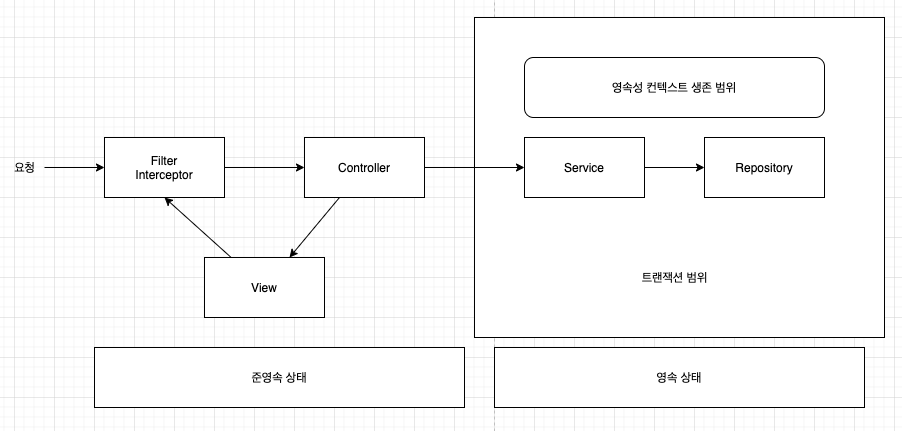
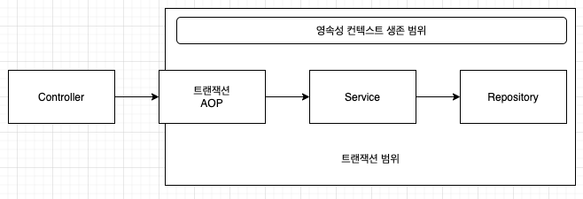

###  스프링 컨테이너의 기본 적략

* 스프링 컨테이너는 트랜잭션 범위의 영속성 컨텍스트 전략을 기본으로 사용한다.
    * 트랜잭션의 범위와 영속성 컨텍스트의 생존 범위는 같다.
    * 즉, 트랜잭션을 시작할 때 영속성 컨텍스트를 생성하고 트랜잭션이 끝날 때 영속성 컨텍스트를 종료한다.



* @Transactional 이 있는 메소드를 사용하면, 해당 메소드를 실행하기 직전에 스프링의 트랜잭션 AOP 가 먼저 동작한다.
* 스프링 트랜잭션 AOP 동작 순서
    1. 대상 메소드를 호출하기 직전에 트랜잭션을 시작한다.
    2. 대상 메소드가 정상 종료되면 트랜잭션을 커밋하면서 종료한다.
    3. 트랜잭션을 커밋하면 JPA 는 먼저 영속성 컨텍스트를 플러시해서 변경 내용을 데이터베이스에 반영한 후 데이터베이스 트랜잭션을 커밋한다.
    4. 만약 예외가 발생하면 트랜잭션을 롤백하고 종료하고, 플러시를 호출하지 않는다.



```java
@Controller
class SomeController {
    ...
    
    public void someMethod() {
        Entity entity = someService.logic();
        // 반환된 entity 객체는 준영속 상태
    }
}

@Service
class SomeService {
    ...
    
    @Transactional
    // 1. 트랜잭션 시작
    // 메소드를 호출할 때 트랜잭션을 먼저 시작한다.
    public Entity logic() {
        Entity entity = repository1.findEntity();
        // 해당 객체는 영속 상태
        return entity;
    }
    // 3. 트랜잭션 종료
    // 메소드가 정상 종료되면 트랜잭션을 커밋한다.
    // 이때 영속성 컨텍스트를 종료한다.
    // 영속성 컨텍스트가 사라졌으므로, ㅏ조회한 엔티티는 준영속 상태가 된다.
    // 서비스 메소드가 끝나면서 트랜잭션과 영속성 컨텍스트가 종료되었으므로,
    // 컨트롤러에 반환된 객체는 준영속 상태의 객체이다.
}

@Repository
class Repository1 {
    ...
    
    public Entity findEntity() {
        return em.find(Entity.class, 1);
        // 영속성 컨텍스트 접근
        // 트랜잭션 범위 안에 존재하기 때문에 영속성 컨텍스트의 관리를 받는다.
    }
}

@Repository
class Repository2 {
    ...
    
    public void hello() {
        em.xxx();
        // 영속성 컨텍스트 접근
    }
}
```

* 트랜잭션 범위의 영속성 컨텍스트 전략
    * 트랜잭션이 같으면 같은 영속성 컨텍스트를 사용한다.
        * 트랜잭션 범위의 영속성 컨텍스트 전략은 다양한 위치에서 엔티티 매니저를 주입받아 사용해도 트랜잭션이 같으면 항상 같은 영속성 컨텍스트를 사용한다.
    * 트랜잭션이 다르면 다른 영속성 컨텍스트를 사용한다.
        * 여러 스레드에서 동시에 요청이 와서 같은 엔티티 매니저를 사용해도 트랜잭션에 따라 접근하는 영속성 컨텍스트는 다르다.
        * 스프링 컨테이너는 스레드마다 각각 다른 트랜잭션을 할당한다.
        * 즉, 같은 엔티티 매니저를 호출해도 접근하는 영속성 컨텍스트가 다르므로 멀티스레드 상황에서 안전하다.

