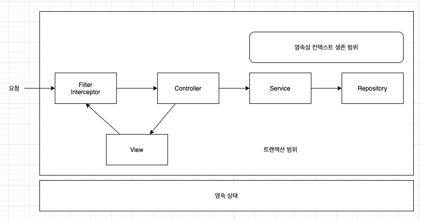
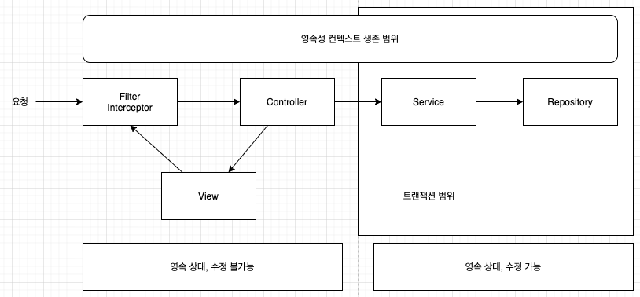

###  스프링 컨테이너의 기본 적략

* 스프링 컨테이너는 트랜잭션 범위의 영속성 컨텍스트 전략을 기본으로 사용한다.
    * 트랜잭션의 범위와 영속성 컨텍스트의 생존 범위는 같다.
    * 즉, 트랜잭션을 시작할 때 영속성 컨텍스트를 생성하고 트랜잭션이 끝날 때 영속성 컨텍스트를 종료한다.


* @Transactional 이 있는 메소드를 사용하면, 해당 메소드를 실행하기 직전에 스프링의 트랜잭션 AOP 가 먼저 동작한다.
* 스프링 트랜잭션 AOP 동작 순서
    1. 대상 메소드를 호출하기 직전에 트랜잭션을 시작한다.
    2. 대상 메소드가 정상 종료되면 트랜잭션을 커밋하면서 종료한다.
    3. 트랜잭션을 커밋하면 JPA 는 먼저 영속성 컨텍스트를 플러시해서 변경 내용을 데이터베이스에 반영한 후 데이터베이스 트랜잭션을 커밋한다.
    4. 만약 예외가 발생하면 트랜잭션을 롤백하고 종료하고, 플러시를 호출하지 않는다.


```java
@Controller
class SomeController {
    ...
    
    public void someMethod() {
        Entity entity = someService.logic();
        // 반환된 entity 객체는 준영속 상태
    }
}

@Service
class SomeService {
    ...
    
    @Transactional
    // 1. 트랜잭션 시작
    // 메소드를 호출할 때 트랜잭션을 먼저 시작한다.
    public Entity logic() {
        Entity entity = repository1.findEntity();
        // 해당 객체는 영속 상태
        return entity;
    }
    // 3. 트랜잭션 종료
    // 메소드가 정상 종료되면 트랜잭션을 커밋한다.
    // 이때 영속성 컨텍스트를 종료한다.
    // 영속성 컨텍스트가 사라졌으므로, ㅏ조회한 엔티티는 준영속 상태가 된다.
    // 서비스 메소드가 끝나면서 트랜잭션과 영속성 컨텍스트가 종료되었으므로,
    // 컨트롤러에 반환된 객체는 준영속 상태의 객체이다.
}

@Repository
class Repository1 {
    ...
    
    public Entity findEntity() {
        return em.find(Entity.class, 1);
        // 영속성 컨텍스트 접근
        // 트랜잭션 범위 안에 존재하기 때문에 영속성 컨텍스트의 관리를 받는다.
    }
}

@Repository
class Repository2 {
    ...
    
    public void hello() {
        em.xxx();
        // 영속성 컨텍스트 접근
    }
}
```

* 트랜잭션 범위의 영속성 컨텍스트 전략
    * 트랜잭션이 같으면 같은 영속성 컨텍스트를 사용한다.
        * 트랜잭션 범위의 영속성 컨텍스트 전략은 다양한 위치에서 엔티티 매니저를 주입받아 사용해도 트랜잭션이 같으면 항상 같은 영속성 컨텍스트를 사용한다.
    * 트랜잭션이 다르면 다른 영속성 컨텍스트를 사용한다.
        * 여러 스레드에서 동시에 요청이 와서 같은 엔티티 매니저를 사용해도 트랜잭션에 따라 접근하는 영속성 컨텍스트는 다르다.
        * 스프링 컨테이너는 스레드마다 각각 다른 트랜잭션을 할당한다.
        * 즉, 같은 엔티티 매니저를 호출해도 접근하는 영속성 컨텍스트가 다르므로 멀티스레드 상황에서 안전하다.

### 준영속 상태와 지연 로딩

```java
@Entity
public class Order {
    @Id
    @GeneratedValue
    private Long id;
    
    @ManyToOne(fetch = Fetch.LAZY)
    private Member member;
    
    ...
}

...

@Controller
class OrderController {
    ...
    
    public String view(Long orderId) {
        Order order = oderService.findOne(orderId);
        Member member = order.getMember();
        member.getName();
        // 지연 로딩 시 예외 발생
        // 컨테이너 환경의 기본 적략인 트랜잭션 범위의 영속성 컨텍스트 전략을 사용하면
        // 트랜잭션이 없는 프리젠테이션 계층에서 엔티티는 준영속이며,
        // 변경 감지와 지연 로딩이 동작하지 않는다. 
    }
}
```

* 준영속 상태와 변경 감지
    * 변경 감지는 영속성 컨텍스트가 살아 있는 서비스 계층까지만 동작
    * 즉, 영속성 컨텍스트가 종료된 프리젠테이션 계층에서는 동작하지 않는다.
        * 프리젠테이션 계층까지 변경 감지 기능이 있다면, 애플리케이션 계층이 가지는 책임이 모호해진다.
        * 또한, 데이터 변경을 찾기 위해 프리젠테이션 계층까지 확인해야 하므로 유지보수가 어려워진다.
    * 보통 변경 감지 기능은 서비스 계층에서 비즈니스 로직을 수행하면서 발생한다.
* 준영속 상태와 지연 로딩
    1. 뷰가 필요한 엔티티를 미리 로딩해두는 방법
        1. 글로벌 페치 전략 수정
        2. JPQL 패치 조인
        3. 강제로 초기화
    2. OSIV 를 사용해서 엔티티를 항상 영속 상태로 유지하는 방법

#### 글로벌 페치 전략 수정

* 가장 간단한 글로벌 패치 전략 수정은 **지연 로딩 -> 즉시 로딩** 으로 변경

```java
...

// @ManyToOne(fetch = Fetch.LAZY)
@ManyToOne(fetch = Fetch.EAGER)
private Member member;

```

* 위와 같이 변경하면 애플리케이션 전체에서 이 엔티티를 로딩할 때마다 해당 전략을 사용하므로, 글로벌 페치 전략이라고 한다.

#### 글로벌 페치 전랴가에 즉시 로딩 사용 시 단점

1. 사용하지 않는 엔티티를 로딩한다.
2. N + 1 문제가 발생한다.
    * 연관된 엔티티를 로딩하는 전략이 즉시 로딩이면 데이터베이스에 JOIN 쿼리를 사용해서 한 번에 연관된 엔티티까지 조회한다.
    
```java
Order order = em.find(Order.class, 1L);

select o.*, m.*
from Order o
left outer join Member m on o.member = m.id
where o.id = 1

...

List<Order> orders = em.createQuery("select o from Order o", Order.class)
                        .getResultList();
// 연관된 모든 엔티티를 조회한다.

select * from Order;
select * from Member where id=?
select * from Member where id=?
select * from Member where id=?
...
// EAGER 로 실행된 SQL
```

* JPA 가 JPQL 을 분석해서 SQL 을 생성할 때는 글로벌 페치 전략을 참고하지 않고 오직 JPQL 자체만 사용한다.
* 따라서 즉시 로딩이든 지연 로딩이든 구분하지 않고 JPQL 쿼리 자체에 충실하게 SQL 을 만든다.
* 위 상황의 내부 동작 순서
    1. select o from order o JPQL 을 분석해서 select * from Order SQL 을 생성한다.
    2. 데이터베이스에서 결과를 받아 Order 엔티티 인스턴스들을 생성한다.
    3. Order.member 의 글로벌 페치 전략이 즉시 로딩이므로 order 가 로딩되는 시점에 연관된 member 도 로딩되어야 한다.
    4. 연관된 member 를 영속성 컨텍스트에서 찾는다.
    5. 영속성 컨텍스트에 없으면 select * from member where id=? SQL 조회한 order 엔티티 수만큼 실행한다.
* 이러한 N + 1 문제는 JPQL 페치 조인으로 해결할 수 있다.

#### JPQL 페치 조인

```java
JPQL
select o from Order o
select o from Order o join fetch o.member

SQL
select * from Order ...
select o.*, m.* from Order o join Member m on o.member = m.id
```

* 페치 조인을 사용하면 SQL JOIN 을 사용해서 페치 조인 대상까지 함께 조회한다.
* 연관된 엔티티를 이미 로딩했으므로 N+1 문제가 발생하지 않는다.
* 페치 조인의 단점
    * 페치 조인을 무분별하게 사용하면 화면에 맞춘 Repository 메소드가 증가한다.
    * 이러한 현상은 프리젠테이션 계층이 데이터 접근계층을 침범하는 것이다.
    * 또는 프리젠테이션 계층 별 repository 메소드를 생성하여 사용할 수 있지만, 이러면 view 와 repository 간의 논리적인 의존관계가 발생한다.
    * 아니면 fetch 조인이 필요한 곳이 발생하면, 기존 연관관계를 사용하던 모든 곳에서 fetch 조인을 사용한다.
        * 사용하지 않는 곳에서도 fetch 조인을 위한 로딩 시간이 추가되겠지만, join 을 사용해서 쿼리 한번으로 필요한 데이터를 조회하므로 성능에 미치는 영향이 미비하다.

#### 강제로 초기화

* 영속성 컨텍스트가 살아있을 때 프리젠테이션 계층이 필요한 엔티티를 강제로 초기화해서 반환하는 방법

```java
// 글로벌 페치 전략이 모두 Lazy 라고 가정

public Order findOrder(Long id) {
    Order order = orderRepository.findOrder(id);
    order.getMember.getName();
    // 프록시 객체를 강제로 초기화 한다.
    // 영속성 컨텍스트가 살아있는 상태에서 초기화 하였으므로 준영속 상태에서도 사용할 수 있다.
    // 하이버네이트의 경우 initialize(Entity) 메소드를 통해 프록시를 강제로 초기화 할 수 있다.
    return order;
}
```

#### FACADE 계층 추가


* 프리젠테이션 계층과 서비스 계층 사이에 FACADE 계층을 하나 추가하는 방법.
    * 뷰를 위한 프록시 초기화는 이곳에서 담당한다.
    * FACADE 계층을 도입해서 서비스 계층과 프리젠테이션 계층 사이에 논리적인 의존성을 분리할 수 있다.
* 프록시를 초기화하려면 영속성 컨텍스트가 필요하므로 FACADE 에서 트랜잭션을 시작해야 한다.
* FACADE 계층의 역할과 특징
    * 프리젠테이션 계층과 도메인 모델 계층 간의 논리적 의존성을 분리해준다.
    * 프리젠테이션 계층에서 필요한 프록시 객체를 초기화 한다.
    * 서비스 계층을 호출해서 비즈니스 로직을 실행한다.
    * 서비스 계층을 호출해서 비즈니스 로직을 실행한다.
    * 리포지토리를 직접 호출해서 뷰가 요구하는 엔티티를 찾는다.
    
```java
class OrderFacade {
    @Autowired OrderService orderService;
    
    public Order findOrder(Long id) {
        Order order = orderService.findOrder(id);
        order.getMember().getName();
        // 프리젠테이션 계층이 필요한 프록시 객체를 강제로 초기화한다.
        return order;
    }
}

class OrderService {
    ...
    
    public Order findOrder(Long id) {
        return orderRepository.findOrder(id);
    }
}
```

* 위와 같이 구성하여 서비스 계층과 프리젠테이션 계층 간에 논리적 의존관계를 제거했다.
* FACADE 의 최대 단점은 하나의 계층이 더 추가되어 더 많은 코드를 작성하게 된다는 것이다.

#### 준영속 상태와 지연 로딩의 문제점

* 대부분 뷰를 개발할 떄, 엔티티 클래스를 보고 개발을 하지, 초기화가 어떤 방식으로 되어있고 되었는지 확인은 잘 하지 않는다.
* 결국 초기화되지 않은 프록시 엔티티를 조회하는 경우가 발생하고, 에러가 발생하게 된다.
* 애플리케이션 로직과 뷰가 물리적으로는 나누어져 있지만, 논리적으로 서로 의존하는 문제때문에 이러한 문제들이 발생한다.
* 결국, 모든 문제는 엔티티가 프리젠테이션 계층에서 준영속 상태이기 때문에 발생한다.
    * 영속성 컨텍스트를 뷰까지 살아있게 하여서 뷰에서도 지연 로딩을 사용할 수 있는 방법이 존재하는데, 이를 OSIV 라고 한다.
    
### OSIV

* Open Session In View
* 영속성 컨텍스트를 뷰까지 열어두는 것을 말한다.
    * 뷰에서 영속성 컨텍스트가 살아있으므로, 지연 로딩인 객체도 뷰단에서 사용할 수 있다.

#### 과거의 OSIV : 요청 당 트랜잭션



* 가장 단순한 구현 방법은 클라이언트의 요청이 들어오자마자 서블릿 필터나 스프링 인터셉터에서 트랜잭션을 시작하고 요청이 끝날 때 트랜잭션이 끝나는 것이다..
    * 이러한 방식을 요청 당 트랜잭션 방식의 OSIV 라고 한다.
* 요청 당 트랜잭션 방식의 OSIV 문제점
    * 요청당 트랜잭션 방법의 OSIV 는 뷰를 렌더링한 후 트랜잭션 커밋을 진행한다.
        * 즉, 프리젠테이션 계층이 엔티티를 변경할 수 있다.
        * 모든 계층에서 영속성 컨텍스트가 살아있으므로, 엔티티를 변경한다면 모든 곳에서 데이터베이스 변경이 일어날 수 있다.
    * 프리젠테이션 계층에서 엔티티를 수정하지 못하게 막는 방법
        1. 엔티티를 읽기 전용 인터페이스로 제공
        2. 엔티티 레핑
        3. DTO 만 반환

##### 엔티티를 읽기 전용 인터페이스로 제공

* 엔티티를 직접 노출하는 대신 읽기 전용 메소드만 제공하는 인터페이스를 프리젠테이션 계층에 제공한다.

```java
interface MemberView {
    public String getName();
}

@Entity
class Member implements Memberview {
    ...
}

class MemberService {
    public MemberView getMember(Long id) {
        return memberRepository.findById(id);
    }
}
```

##### 엔티티 레핑

* 엔티티의 읽기 전용 메소드만 가지고 있는 엔티티를 감싼 객체를 만들고, 이를 프리젠테이션 계층에 반환한다.

```java
class MemberWrapper {
    private Member member;
    
    public MemberWrapper(Member member) {
        this.member = member;
    }
    
    // 읽기 전용 메소드만 제공
    public String getName() {
        member.getName();
    }
}

class MemberService {
    public MemberWrapper getMember(Long id) {
        return MemberWrapper(
                memberRepository.findById(id)
        );
    }
}
```

##### DTO 만 반환

* 프리젠테이션 계층에 엔티티 대신 단순히 데이터만 전달하는 DTO(Data Transfer Object) 를 전달한다.
    * 위 방식은 OSIV 를 사용하는 장점을 살릴 수 없고, 엔티티를 거의 복사한 듯한 DTO 클래스도 하나 더 만들어야 한다.
    
```java
@Getter
@Setter
class MemberDTO {
    private String name;
    
    ...
}
```

##### 요청 당 트랜잭션 OSIV 결론

* 지금까지의 모든 방법은 코드량이 상당히 증가한다.
* OSIV 를 사용하지 않고 컨벤션을 정하는게 더 좋을 수 있다.
* 여러 문제점 때문에 '요청 당 트랜잭션 OSIV' 는 거의 사용하지 않는다.

#### 스프링 OSIV - 바ㅣ즈니스 계층 트랜잭션

* 스프링 프레임워크가 제공하는 OSIV
    1. 하이버네이트 OSIV 서블릿 필터
    2. 하이버네이트 OSIV 스프링 인터셉터
    3. JPA OEIV 서블릿 필터
    4. JPA OEIV 스프링 필터

##### 스프링 OSIV 분석



1. 클라이언트의 요청이 들어오면 서블릿 필터나, 스프링 인터셉터에서 영속성 컨텍스트를 생성한다.
    * 이때 트랜잭션은 시작하지 않는다.
2. 서비스 계층에서 @Transactional 로 트랜잭션을 시작할 때 1번에서 미리 생성해둔 영속성 컨텍스트를 찾아와서 트랜잭션을 시작한다.
3. 서비스 계층이 끝나면 트랜잭션을 커밋하고 영속성 컨텍스트를 플러시한다.
    * 이때 영속성 컨텍스트는 종료하지 않는다.
4. 컨트롤러와 뷰까지 영속성 컨텍스트가 유지되므로, 조회한 엔티티는 영속 상태를 유지한다.
5. 서블릿 필터나, 스프링 인터셉터로 요청이 돌아오면 영속성 컨텍스트를 종료한다.
    * 이때는 플러시를 호출하지 않고 바로 종료한다.
